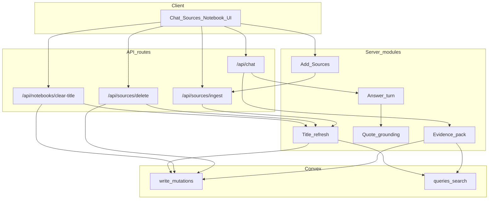

# Architecture deepenings (all seven)

## Overview

Deepen seven shallow seams in dependency order, with API-route orchestration and Convex write mutations as a new repo AGENTS rule. Commit after each deepening (plus an initial AGENTS commit).

## Decisions locked

- **Orchestration** lives in API routes (and shared server modules those routes / pipelines call). **Writes** are individual Convex mutations.
- Client → Convex remains for thin CRUD (select, non-empty rename). **Delete Source** and **clear Notebook title** move behind small API routes because they chain writes + title refresh.
- Title refresh: one deep server module; **ingest calls it in-process** after `markReady`; HTTP route is the adapter for delete / clear-title.
- `prepareEvidence` **moves out of Convex** during the evidence-pack deepen.
- Answer turn accepts a **`generateAnswer` port** (OpenAI prod adapter + test fake).
- Order: dependency order below; **one git commit per deepening**.

## Repo rule (commit 0)

Add [`AGENTS.md`](../../AGENTS.md):

- Multi-step / LLM / `waitUntil` orchestration → API routes + `src/server/**` modules.
- Durable writes → focused Convex mutations (route calls them; no Convex actions for LLM orchestration).
- Thin realtime CRUD may stay client → Convex.
- Server pipelines (e.g. `processSource`) may call the same orchestrator modules in-process; they must not reimplement policy.

Create [`CONTEXT.md`](../../CONTEXT.md) with PRODUCT terms plus new module names as they land (Answer turn, Quote grounding, Evidence pack, Title refresh, Add Sources).

## Target flow

---

## Commit 1 — Unify Citation quote grounding

**Files:** `src/lib/citationQuote.ts`, `src/lib/citationHighlight.ts`, `src/lib/citationMatch.ts`, consumers in `answerCitationCatalog.ts`, `sourceDigest.ts`, `SourcePreview.tsx`.

**Deepen:** one module grounds a quote in a text span → `{ excerpt, range, locator? }`. Server catalog and client preview share it; delete duplicate locate/score paths in highlight.

**Tests:** same quote → server locator and client offsets agree.

---

## Commit 2 — Deepen the Answer turn

**Files:** extract from `src/server/chat/handleChatPost.ts` (~698 lines); fold `answerCitationCatalog.ts`; use quote grounding + `citations.ts`.

**Deepen:** `runAnswerTurn({ evidence, history, generateAnswer, onPartial })` → final content, citation catalog, insufficient flag. `handleChatPost` stays auth, prepare/finalize mutations, SSE encode, wire to the module.

**Port:** `generateAnswer` — prod OpenAI structured stream; tests inject a fake.

Still calls today’s Convex `prepareEvidence` until commit 3.

---

## Commit 3 — Prompt-ready Evidence pack + move orchestration

**Files:** move logic from `src/convex/retrieval.ts` action into `src/server/chat/` (or `src/server/retrieval/`); keep search/list helpers as Convex queries; progress via mutations.

**Deepen:** pack interface is prompt-ready: evidence block string, allowed chunk ids, chunk text map, mode, insufficient. Corpus/digest/flat formatting and system addenda live here — Chat stops re-deriving `useCorpusLayout`.

Delete Convex `prepareEvidence` action; Chat route calls the server Evidence pack module (Voyage embed/rerank on server).

---

## Commit 4 — Citation display view-model

**Files:** `chatSse.ts`, catalog builders, `AssistantContent.tsx`, `CitationPills.tsx`, `ChatAssistantMessage.tsx`, chat list enrichment.

**Deepen:** one answer view-model — display markdown + ordered cite slots (title, excerpt, navigate, locator). Stream and persist emit the same shape; collapse duplicate `ChatCitation` / `StreamCitation` adapters.

---

## Commit 5 — Notebook titles (schedule + propose + routes)

**Replace** Convex `refreshNotebookTitle` action + `ctx.scheduler` LLM kick with:

1. **Mutation** `scheduleTitleRefresh(notebookId)` — bump `titleRefreshGeneration`, set `pending` (collapse copies in `ingestion.ts`, `sources.ts`, `notebooks.ts`).
2. **Pure** `proposeNotebookTitle(corpus, modelOutput)` — accept / fallback / failed (`notebookTitleQuality.ts`, trim dead paths in `sourceTitle.ts`).
3. **Server module** `refreshNotebookTitle` — read sources/digests via Convex, debounce in-process (`scheduleBackground` + delay), staleness check on generation, LLM, `proposeNotebookTitle`, apply via mutations.
4. **Routes:**
   - clear-title → clear mutation + schedule + `refreshNotebookTitle`
   - delete Source → remove mutation + schedule + refresh
5. **Ingest:** after `markReady`, call schedule mutation + in-process `refreshNotebookTitle` (no self-HTTP).
6. Non-empty rename stays client → `notebooks.rename`.

Wire UI delete / empty-title through the new routes.

---

## Commit 6 — Client Add Sources module

**Files:** `ingestClient.ts`, `uploadSourceFiles.ts`, `useSourceUpload.ts`, add-dialog data, `pendingSources.ts`, `uploadingSources.ts`.

**Deepen:** `addSources({ notebookId, urls | texts | files })` owns pending rows, storage upload, ingest POST, LIMITS, success/fail bookkeeping. Hooks become thin UI bindings.

---

## Verification

After each commit: `bun types`, `bun fix`, `bun run test` (or repo equivalents). No drive-by refactors outside the deepening’s files.
