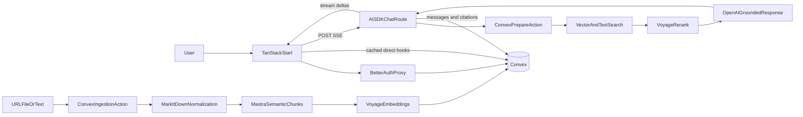

# Corpus Implementation Plan

## Product boundary

Build Corpus as a polished English-language NotebookLM-style MVP with:

- Complete Google and verified email/password authentication.
- A notebook library with search, cursor pagination, creation, rename, and permanent deletion.
- URL, file, and pasted-text sources with realtime processing states.
- One strictly source-grounded chat thread per notebook.
- Paragraph-level citations with exact source passages.
- Responsive desktop and mobile layouts.

Studio features, audio overviews, sharing, collaboration, native apps, account deletion, profile editing, MFA, and a marketing site are outside v1.

## Technical foundation

- Scaffold a Bun-managed TanStack Start application with TypeScript.
- Use Tailwind CSS 4 and customized shadcn components with preset `b6Z8GIMhE`.
- Use Motion for purposeful interface and layout transitions.
- Use Phosphor regular icons consistently, with filled variants only for selected states.
- Self-host the Figtree variable font and use tabular numerals for dates and counts.
- Use named exports, small focused modules, and the repository's generated Convex types.
- Record durable product and visual decisions in `PRODUCT.md` and `DESIGN.md`.
- Use [color-palettes.html](color-palettes.html) and [type-and-icons.html](type-and-icons.html) as visual references.

## Visual system and interaction polish

### Palette and surfaces

- Use the selected Green mineral palette:
  - Light background: `#F1F3EE`
  - Light surface: `#FAFBF8`
  - Light pine: `#245844`
  - Light text: `#1E2823`
  - Light muted text: `#68736C`
  - Light border: `#D8DED7`
  - Dark background: `#141A17`
  - Dark surface: `#1B231F`
  - Dark pine: `#79B999`
- Keep pine as the sole decorative accent. Reserve red, amber, and green variants for semantic feedback.
- Use soft pine-tinted borders and shadows instead of black shadows.
- Use a restrained radius hierarchy:
  - 16px for cards, dialogs, and the composer.
  - 12px for fields, menus, and drop zones.
  - 10px for buttons and icon controls.
  - Full pills only for citations and compact status elements.
- Add one fixed, pointer-free atmospheric layer to broad auth, library, and empty-state backgrounds. Combine a low-opacity pine radial wash with fine monochrome noise. Keep cards, menus, source previews, and reading surfaces clean. Remove noise when reduced transparency is requested.

### Motion

- Use approximately 120ms for hover and press feedback, 150ms for menus and tooltips, and 180ms for dialogs, tabs, panels, and layout changes.
- Use an ease-out curve close to `[0.16, 1, 0.3, 1]`.
- Fade and move menus by about 4px.
- Fade and scale dialogs from approximately 98.5%.
- Lift notebook cards by no more than 2px.
- Use Motion layout transitions whenever geometry changes:
  - Add-source dialog mode and height.
  - Inline validation and error messages.
  - Source insertion, removal, and reordering.
  - Source list and preview swaps.
  - Mobile tab content.
  - Autosizing composer height.
- Crossfade realtime content in place. Avoid decorative entrance choreography.
- Under reduced motion, remove transforms and use near-instant opacity changes.

### Loading, errors, and copy

- Do not create separate skeleton component trees.
- Render production components with placeholder records that preserve final typography and dimensions.
- Make placeholder text transparent and add soft rounded fills with a restrained pine-tinted shimmer.
- Hide dummy placeholder content from assistive technology and expose one live loading status.
- Use static placeholder fills under reduced motion.
- Keep field errors below their fields, ingestion errors inside source rows, and generation errors beneath responses.
- Reserve toasts for transient outcomes without a stable visual home.
- Use calm, direct, sentence-case copy with concrete recovery guidance.

## Routes and application shell

Create these primary routes:

- `src/routes/__root.tsx`: global providers, theme bootstrap, document shell, and shared header.
- `src/routes/index.tsx`: authenticated notebook library.
- `src/routes/notebooks/$notebookId.tsx`: notebook workspace.
- `src/routes/sign-in.tsx`, `sign-up.tsx`, `verify-email.tsx`, and password-reset routes.
- `src/routes/api/auth/$.ts`: Better Auth proxy.
- `src/routes/api/chat.ts`: authenticated AI SDK SSE bridge.
- An authenticated source-content route for normalized Markdown previews.

The shared 4rem header uses a softly raised pine Books icon tile plus the Figtree 700 Corpus wordmark. The entire lockup links to the library. Separate theme and account controls sit at the right.

On desktop notebook pages, align the header to the workspace split:

- A 25rem left cell contains the Corpus lockup.
- The right cell contains the inline-editable notebook title plus theme and account controls.
- The workspace below uses a fixed 25rem Sources pane and a centered Chat measure of at most 50rem.

On mobile:

- Keep the global brand and actions in the first header row.
- Place the notebook title below.
- Use a sticky, softly raised segmented control for Sources and Chat.
- New notebooks open on Sources. Existing notebooks with sources open on Chat.
- Store the selected tab in the URL.

## Client data and global state

- Instantiate a direct `ConvexReactClient`.
- Wrap it with `ConvexBetterAuthProvider`.
- Nest `ConvexQueryCacheProvider` from `convex-helpers/react/cache`.
- Import cached `useQuery`, `useQueries`, and `usePaginatedQuery` hooks from `convex-helpers`.
- Do not install or use React Query.
- Use Zustand for app-owned global state such as Light/Dark/System preference and any cross-route draft state.
- Keep isolated dialog, menu, input, and hover state local to components.
- Apply the selected theme before hydration and update System mode when the operating-system preference changes.

## Authentication and email

Configure `@convex-dev/better-auth` in:

- `convex/convex.config.ts`
- `convex/auth.config.ts`
- `convex/auth.ts`
- `convex/http.ts`
- `src/lib/auth-client.ts`
- `src/lib/auth-server.ts`

Support:

- Google OAuth.
- Email/password sign-up and sign-in.
- Mandatory email verification.
- Resend-verification.
- Forgot and reset password.
- Persistent sessions.
- Safe same-email account linking only when Better Auth can verify the address.
- Sign-out with the integration's required reload behavior.

Use the official `@convex-dev/resend` component. Render verification and reset templates with React Email inside Convex Node actions. Configure durable queueing, idempotency, rate limiting, webhook verification, and delivery-state logging.

Unauthenticated visitors go directly to a focused authentication experience rather than a marketing page. Use a stable 28rem raised panel with the Corpus lockup above it. Put Google first, followed by a divider and labeled email/password fields. Reuse the same panel dimensions for sign-in, sign-up, verification, and reset states.

## Convex data model

Define owned records in `convex/schema.ts` for:

- `notebooks`
  - Owner ID
  - Display title
  - Title origin: placeholder, generated, or manual
  - Title-generation state
  - Current chat epoch
  - Current effective-source revision
  - Created, updated, and last-used timestamps
- `sources`
  - Owner and notebook IDs
  - URL, file, or text kind
  - Editable display title
  - Immutable source metadata
  - Original and normalized storage IDs
  - Selected state
  - Processing state and safe error code
  - Extracted character count
  - Created and updated timestamps
- `chunks`
  - Owner, notebook, and source IDs
  - Chunk text
  - Stable ordinal and normalized-text offsets
  - Searchable text
  - 1,024-dimensional embedding
- `chatEntries`
  - Notebook and chat epoch
  - Message or source-boundary kind
  - User or assistant role
  - Content and generation status
  - Effective-source revision
  - Exchange and generation IDs
  - Created timestamp
- `citations`
  - Assistant message ID
  - Live source and chunk IDs when available
  - Source-title snapshot
  - Exact cited excerpt
  - Normalized source locator
  - Citation order
- `dailyUsage`
  - User, date, ingestion count, and generation count

Create indexes for:

- Notebook ownership and `lastUsedAt`.
- Notebook title search.
- Sources by notebook and creation time.
- Chunks by source/notebook.
- Chunk full-text search.
- Chunk vector search with `sourceId` available as a filter field.
- Chat entries by notebook, epoch, and order.
- Citations by assistant message.
- Daily usage by user and date.

Centralize `requireUser` and `requireNotebookOwner` helpers. Apply them to every query, mutation, action, upload, preview, deletion, and SSE persistence operation.

## Limits and abuse prevention

Enforce on the server before paid operations:

- 100 notebooks per account.
- 20 visible source records per notebook, including pending and failed sources.
- 50 source ingestions per user per day.
- 100 chat generations per user per day.
- One active generation per notebook.
- 20MB per uploaded file.
- 2MB maximum fetched URL response.
- 200,000 characters per pasted-text source.
- 500,000 extracted characters per source.
- 4,000 characters per chat prompt.

Return direct error messages that name the limit and, where relevant, its reset time.

## Notebook library

Build a max-width 84rem library below the shared header:

- `Your notebooks` sits at the left of the heading row.
- A pine New notebook button sits at the right.
- A 20rem title search field sits below the heading and becomes full width on mobile.
- Search is server-side, debounced, and resets pagination.
- Use cursor-based Previous/Next pagination with at most 12 records.
- Preserve the cursor in the URL so browser Back restores the page.
- Sort notebooks by `lastUsedAt` descending.
- Update `lastUsedAt` when opening, renaming, chatting, or changing sources.

Responsive notebook cards use:

- Four columns on wide desktop.
- Three columns on laptop.
- Two columns on tablet.
- Condensed full-width rows below 640px.

Each card contains:

- One consistent Phosphor Notebook icon in a pine-tinted tile.
- A title clamped to two lines.
- Relative last-used time.
- Count of every visible source record.
- A menu for Rename and Delete.

The full card opens the notebook. The menu is independently keyboard accessible and never triggers navigation.

Creating a notebook:

1. Creates `Untitled notebook` in one click.
2. Navigates immediately.
3. Does not ask for a title.
4. Opens Sources on mobile.

Renaming trims whitespace, accepts 1-100 characters, permits duplicates, and maps an empty result back to `Untitled notebook`.

Permanent notebook deletion:

- Names the notebook in a confirmation dialog.
- Cancels an active response.
- Removes the notebook from the library immediately.
- Schedules bounded deletion of messages, citations, chunks, sources, and stored files.
- Has no trash or undo in v1.

Use distinct states:

- First-run library: raised Books icon, `Create your first notebook`, one practical sentence, and New notebook.
- No search matches: `No notebooks match "..."` and Clear search.

## Notebook title

On the detail page, render the title in a layout-stable inline field that visually reads as text:

- Click focuses and selects it.
- Enter or blur saves.
- Escape restores the prior title.
- Empty save becomes `Untitled notebook`.
- Beginning manual editing permanently prevents a pending automatic title from overwriting it.

When the first source finishes successfully, use `gpt-5.4-nano` to generate a short notebook title once. Apply it only when the notebook remains placeholder-owned. Never regenerate after source changes or deletion. Keep `Untitled notebook` if generation fails.

## Sources pane and controls

Order controls as:

1. Sources heading and pine Add button.
2. Full-width title search.
3. Select all row with selected/total count.
4. Scrollable source list.

Source title search:

- Matches titles only.
- Filters the realtime client result immediately.
- Preserves checkbox state.
- Makes Select all affect only visible matches.
- Shows an indeterminate master checkbox for mixed state.

Order sources newest first and keep that order stable through status and rename changes.

Each source row uses:

- Type icon and two-line title/status on the left.
- Menu followed by the required rightmost checkbox.
- Menu visibility on hover/focus and permanent visibility on touch devices.
- Row-body click to open preview.
- Independent checkbox and menu interactions.

New and pending sources are selected by default. Pending sources remain selectable. Failed sources cannot be selected.

The count on notebook cards and the 20-source quota include every non-deleted source record, including pending and failed records. Deleting a failed source frees a slot.

## Add source experience

Use a 32rem stacked dialog:

1. An immediately focused URL input and Add action.
2. A quiet `or` divider.
3. A generous file-drop area.
4. An Add pasted text secondary action.

Switching to pasted text:

- Crossfades and animates the dialog height without changing its outer placement.
- Focuses a 10rem textarea immediately.
- Provides Back to restore the initial mode.

Successful URL/text submission closes the dialog after enqueue. Dropping one or more valid files adds each as an independent source and closes the dialog.

Dragging files anywhere over the Sources pane reveals one inset drop surface without shifting layout. Validate a multi-file batch per file:

- Enqueue valid files.
- Report rejected files concisely.
- Do not reject the whole batch because one file fails.
- Respect the remaining 20-source quota.

Menus and dialogs:

- Close on Escape and outside click.
- Restore focus to their trigger.
- Trap focus inside modal dialogs.
- Use the confirmed soft 150-180ms fade and transform animation.

## Source normalization and indexing

Create a normalization adapter such as `src/server/sources/normalize.ts` around `markitdown-ts`.

Accepted file formats:

- PDF
- DOCX
- XLSX
- HTML
- TXT
- Markdown
- CSV
- XML
- RSS
- Atom
- IPYNB

Reject:

- Images
- Audio
- ZIP
- PowerPoint
- Encrypted files
- Unsupported files
- Files with no useful extracted text

Validate extension, MIME type, and magic bytes where feasible. Keep the original uploaded file in Convex storage for retry/reprocessing, but expose only the normalized read-only preview in v1.

URL ingestion supports public HTTP(S) HTML pages only:

- Reject credentials in URLs.
- Resolve DNS before connecting.
- Block loopback, private, link-local, and cloud-metadata ranges.
- Revalidate every redirect target.
- Limit redirects, response bytes, and request duration.
- Do not execute JavaScript.
- Extract main content with basic readability heuristics.
- Fall back to body content.
- Convert the cleaned HTML to Markdown.
- Reject login walls, unsupported MIME types, and empty extraction.

Title rules:

- URL: cleaned HTML title, then hostname plus path.
- File: original filename including extension.
- Pasted text: first non-empty line, then `Pasted text`.
- Normalize whitespace and display at most 100 characters.
- Retain complete original metadata internally.
- Permit duplicate titles.

Source content remains immutable. Display metadata may be renamed in a compact modal that immediately focuses and selects the existing name.

## Realtime processing

Create a source record immediately and write these intermediate states to Convex:

1. `pending`
2. `extracting`
3. `chunking`
4. `embedding`
5. `ready` or `failed`

Do not introduce a discovery queue or workflow system. Schedule the processing action and update state at each meaningful boundary.

The UI renders the real row immediately:

- Use a small Phosphor CircleNotch plus plain status text.
- Do not display fake percentages.
- Permit activation changes while pending.
- Exclude incomplete sources from chat retrieval.
- Keep failures visible with a safe error, Retry, and Delete.

Normalize all accepted content to Markdown, then use Mastra semantic Markdown chunking. Store stable source ordinals and normalized-text offsets with every chunk.

Embed chunks with:

- Model: `voyage-4-large`
- Dimension: 1,024
- Float vectors stored in Convex

When a selected pending source becomes ready during a response, finish the response using its original source snapshot, then append the coalesced source-change boundary. The source becomes available on the next turn.

## Source preview and citation navigation

Clicking a source title replaces the Sources list with a pane-local preview:

- Sticky Back control.
- Current source title and menu.
- Read-only normalized Markdown.
- No in-document search in v1.
- Back restores the list and its scroll position.

Citation navigation:

- Returns from the list to the preview if needed.
- Scrolls the exact normalized passage into the upper third.
- Applies a soft pine wash and 3px pine edge.
- Fades the stronger arrival state into a persistent pale highlight.
- On mobile, switches to Sources first.

The source-count control beside Send:

- Shows a Phosphor stack and text such as `3 sources`.
- Has an accessible label such as `3 active sources`.
- Sits immediately left of Send/Stop.
- On desktop, returns to the source list, scrolls selected rows into view, moves accessible focus to the Sources heading, and briefly highlights active rows.
- On mobile, switches to Sources.
- Does not focus the search field.

## Source context epochs

Keep all visible messages, but exclude every exchange before the latest effective-source boundary from future prompts.

The effective source set contains ready and selected sources. Create a new context revision when:

- A ready source is selected or deselected.
- A selected pending source becomes ready.
- A ready selected source is deleted.

Do not create a boundary for metadata rename.

Behavior:

- Coalesce repeated changes into one trailing boundary until another message is sent.
- Do not render a separator when no successful prior exchange exists.
- If a response streams, defer the boundary until it finishes.
- Use a full-width divider labeled `Sources changed` with the current active count beneath it.
- The 10-exchange history window starts after the newest boundary.

## Grounded retrieval

For each chat turn:

1. Validate auth, notebook ownership, quota, prompt length, and absence of another active generation.
2. Snapshot ready-selected source IDs and the current source revision.
3. Load the latest 10 successful user/assistant pairs after the latest source boundary.
4. Embed the new query with `voyage-4-large`.
5. Search Convex vector and full-text indexes in parallel.
6. Restrict vector search to selected source IDs with an OR filter.
7. Merge and deduplicate candidates.
8. Rerank candidates with `rerank-2.5`.
9. Select the highest-ranked chunks within a fixed evidence/token budget.
10. Return the evidence pack to the SSE route.

Use Convex for both vector and full-text retrieval. Keep retrieval orchestration in a Convex action so access checks, filters, and source snapshots remain authoritative.

## Streaming chat

Implement `src/routes/api/chat.ts` as an authenticated AI SDK SSE bridge:

- Use `gpt-5.4-mini` for grounded chat.
- Keep model aliases in centralized server configuration.
- Insert the user message and pending assistant record before generation.
- Stream Markdown text to the client.
- Persist throttled partial text for recovery without writing every token.
- Finalize content, status, and citations atomically where practical.
- Abort the provider request when the client presses Stop or the SSE connection closes.

Strict grounding policy:

- Disable Send when no ready-selected source exists.
- Ignore selected sources that are still incomplete.
- Do not use general model knowledge to fill evidence gaps.
- State that the selected sources do not support the answer when evidence is insufficient.
- Require citations for every substantive factual paragraph.
- Permit brief conversational or insufficiency statements without citations.

Citation output:

- Instruct the model to reference only supplied chunk IDs.
- Parse citations incrementally where possible.
- Validate every citation against the evidence pack.
- Retry validation once before marking the attempt failed.
- Store only the exact cited excerpt, source title at generation, locator, and source ID as message-owned citation data.

Citation UI:

- Use compact numbered pine pills after paragraphs.
- On desktop, hover or keyboard focus shows the saved excerpt after a short delay.
- Clicking opens and highlights the live source.
- On mobile, tapping a live citation switches directly to Sources.
- Deleted-source citations open their retained excerpt popover but cannot navigate.
- While a source exists, show its current renamed title.
- After deletion, fall back to the title snapshot.

Deleting a source:

- Requires confirmation.
- Purges its upload, normalized content, chunks, and embeddings.
- Preserves only excerpts already copied into message citations.
- Clearly states that those excerpts remain until chat or notebook deletion.

## Chat history, cancellation, and retry

Treat one exchange as one successful user/assistant pair.

Future model context includes:

- The current system instructions.
- Current retrieved evidence.
- The new user message.
- At most the latest 10 successful pairs after the latest source boundary.

Exclude failed and canceled attempts. Do not summarize older exchanges in v1.

Allow only one stream per notebook.

Stop or stream failure:

- Preserve partial assistant text.
- Mark it Canceled or Failed.
- Show Retry directly beneath it.
- Use a compact error slot when failure occurs before any text arrives.
- Exclude the attempt from future context.

Retry:

- Is available only while the failed/canceled response is the latest exchange.
- Reuses that exchange's user prompt.
- Uses the current ready-selected source set.
- Replaces the assistant record in place.
- Does not append another user message.
- Disappears when the user sends a newer message.

Navigating, refreshing, or closing during a stream:

- Cancels provider generation where possible.
- Persists received partial text as Canceled.
- Makes the attempt retryable on return.
- Does not continue in the background.

Clear chat:

- Requires confirmation.
- Cancels active generation.
- Permanently removes all messages and citation snapshots.
- Retains sources and selected states.
- Starts an empty chat without a source-change divider.

## Chat presentation

- Render assistant responses as unboxed readable text.
- Render user messages as compact right-aligned raised bubbles.
- Keep the conversation centered at a maximum of 50rem.
- Use generous vertical rhythm and sanitized Markdown rendering.
- Keep citations directly after their paragraphs.
- Auto-scroll during streaming only while the user remains near the bottom.
- Do not take control when the user scrolls upward.

Empty chat with ready sources:

- Show a left-aligned `Ask your sources` introduction.
- Add one concise sentence.
- Present three clickable prompt rows, not equal cards.

Empty chat without ready-selected sources:

- Explain what is required.
- Provide a control that navigates to Sources.

Composer:

- Starts at about four lines and grows to approximately ten.
- Uses generous internal padding.
- Limits input to 4,000 characters.
- Shows remaining count near the limit.
- Enter sends.
- Shift+Enter inserts a newline.
- Preserves typed text while selected sources process.
- Changes Send to Stop without changing button dimensions.

## Responsive details

- Desktop notebook workspace is full height beneath the 4rem header.
- Sources remains fixed at 25rem.
- Chat flexes while its readable content remains at most 50rem.
- Avoid wrapping the entire workspace in floating cards.
- At mobile widths, show one full-width pane at a time.
- Keep the segmented Sources/Chat control sticky.
- Citation navigation switches tabs without remounting the chat draft.
- Condense notebook cards into list-like rows.
- Keep menus permanently discoverable on touch.
- File drag affordances are desktop enhancements; mobile relies on the file picker.

## Accessibility

- Meet WCAG AA contrast for text, controls, placeholders, focus rings, and error states.
- Use visible pine focus rings that do not rely on color alone.
- Provide accessible names for icon-only controls.
- Preserve logical focus order through animated layout changes.
- Trap and restore focus for dialogs.
- Restore focus after menus close.
- Make inline notebook editing keyboard complete.
- Use live regions for source status, generation status, and route-level errors.
- Keep hidden hit areas around small citation pills while preserving their compact visual size.
- Ensure loading placeholder data is inert and hidden from assistive technology.
- Test keyboard-only use, screen-reader names, light/dark contrast, zoom, and reduced motion.

## Data deletion strategy

Convex mutations have bounded transaction limits. Use immediate logical removal plus background physical deletion:

- Notebook deletion marks the notebook deleted and excludes it from all queries immediately.
- Clear chat increments the current chat epoch and excludes old entries immediately.
- Source deletion marks the source deleted and removes it from effective-source retrieval immediately.
- Schedule internal functions that delete dependent records and storage in bounded batches.
- Make cleanup idempotent so retries cannot corrupt current data.

## Retrieval and chat flow

## Testing

Prefer focused tests for behavior with meaningful failure risk.

Unit-test pure helpers for:

- Source-title fallback and normalization.
- URL validation, DNS/redirect SSRF rejection, and response limits.
- Accepted file-type detection.
- Chunk locator derivation.
- Hybrid retrieval merge and deduplication.
- Evidence budget selection.
- Citation parsing and validation.
- Successful-pair history windows.
- Context-revision and boundary coalescing.
- Quota calculations.
- Retry replacement eligibility.

Use `convex-test` for:

- Notebook/source ownership isolation.
- Library search, ordering, and cursor pagination.
- Source state transitions.
- Selected pending-to-ready behavior.
- Context boundaries.
- Citation snapshot retention.
- Chat clear and deletion epochs.
- Idempotent bounded cleanup.

Add browser smoke coverage for:

- Auth route guards.
- One-click notebook creation and navigation.
- Library search and responsive card/list behavior.
- Inline notebook title editing.
- Add-source dialog autofocus and mode change.
- File-drop insertion/removal animation.
- Mobile Sources/Chat tabs.
- Cancel and latest-response Retry.
- Citation popover and source navigation.

Do not make live OpenAI, Voyage, Google, or Resend calls in the regular test suite. Keep provider boundaries injectable and manually verify the complete live integration before deployment.

## Deployment and documentation

Deploy:

- TanStack Start and SSE routes to Vercel.
- Data, storage, actions, search indexes, and auth component to hosted Convex.
- Transactional email through a verified Resend domain.

Configure:

- Local, preview, and production site URLs.
- Better Auth secret.
- Google OAuth client and callback URLs.
- Convex deployment URLs.
- OpenAI key and model aliases.
- Voyage key and model aliases.
- Resend API key, sender, and webhook secret.

Document in `README.md`:

- Architecture and data flow.
- Local setup using Bun.
- Required external services and environment variable names without values.
- Supported source types and limits.
- Auth callback setup.
- Convex and Vercel deployment.
- Resend webhook setup.
- Verification commands.
- Known v1 exclusions.

## Implementation order

1. Scaffold TanStack Start, Tailwind, shadcn, Figtree, Phosphor, Motion, formatting, type checking, and tests.
2. Record `PRODUCT.md` and `DESIGN.md`, then implement theme tokens, atmosphere, motion primitives, and shared components.
3. Configure Convex, Better Auth, direct cached Convex hooks, protected routes, Google auth, email verification, and reset flows.
4. Implement the Convex schema, ownership helpers, notebook CRUD/search/pagination, quotas, and deletion epochs.
5. Build and polish the notebook library with all loading, empty, error, responsive, and menu states.
6. Implement the Sources pane, add dialog, drag/drop, source metadata, selection, title filtering, and realtime processing states.
7. Implement secure file/URL/text normalization, Mastra chunking, Voyage embeddings, source preview, and automatic notebook titles.
8. Implement source-context revisions and source-change separators.
9. Implement hybrid retrieval, Voyage reranking, AI SDK SSE streaming, persistence, cancellation, retry, and strict grounding.
10. Implement citation snapshots, paragraph pills, excerpt popovers, exact preview navigation, and deletion behavior.
11. Complete responsive mobile tabs, focus behavior, layout animations, loading placeholders, radial noise, and accessibility.
12. Add targeted unit, Convex, and browser tests.
13. Run formatting, linting, types, tests, light/dark visual review, responsive browser review, and live provider verification.
14. Complete README deployment instructions and deploy to Convex and Vercel.
